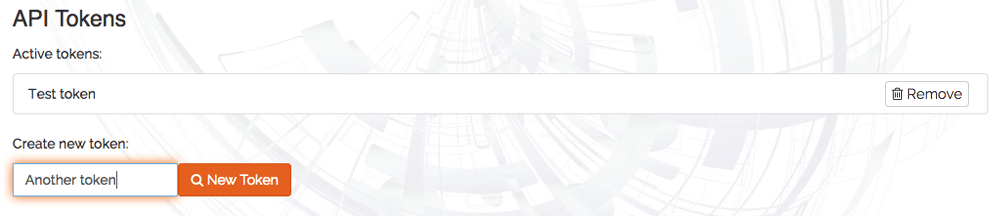
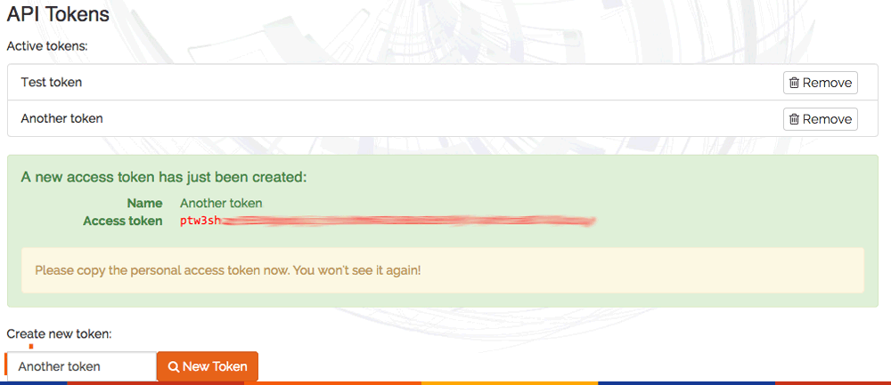

# Getting you API token

This guide will take you through the steps to obtain access tokens on the B2SHARE website. API or access tokens are required to access the B2SHARE service programmatically through the REST API.

The B2HARE HTTP REST API can be used for interaction with B2SHARE via external services or applications. Only authenticated users can do API requests. User authentication is done by passing an `access_token` parameter along with the request. This `access_token` can be retrieved by generating one on the B2SHARE service website.

Please note that access tokens are for private use only and not to be shared with other persons or institutions. Sharing them enables other people to alter your data on your behalf.

## Setup your machine and connection
Please make sure your machine has been properly set up to use Python and required packages. Follow [this](A_Setup_and_install.md) guide in order to do so.

This guide assumes you have successfully registered your account on B2SHARE using your institutional credentials or social ID through B2ACCESS.

## The account page
To create new access tokens for personal use, you need to register them on your account page of the [B2SHARE website](https://trng-b2share.eudat.eu).

After logging in, navigate to your [account page](https://trng-b2share.eudat.eu/user) by clicking on your name on the home page of B2SHARE.



## API token generation
Enter a name in the textfield below 'Create new token:' which easily identifies the purpose for this key. By clicking on `New Token`, a new access token is generated which is only shown at this time. Store it somewhere in order to use later, like in a file. In this training module it is assumed that the generated token is stored in a file called `token.txt`.



**Note 1:** Please note that this is the only time the access token is visible, so copy it to a safe place.

**Note 2:** It is not possible to programmatically register new or administer existing tokens. This can only be done through the [B2SHARE website](https://trng-b2share.eudat.eu).

#### Deleting a token
You can delete a token by clicking on the 'Remove' button next to each token's title. Once a token has been removed it can no longer be used to authenticate a user while using the B2SHARE REST API.

## Testing your token
Once you have generated your access token, it can be used and tested with your own applications. Launch a Python session and follow the steps below to verify whether the token works.

#### Read the token from file
Assuming you have stored the access token in a file named `token.txt` and it is accessible from the current working directory, you can read it using the following commands in a Python session:
```python
>>> f = open(r'token.txt', 'r')
>>> token = f.read().strip()
```

Test your reading by displaying the value of your access token:

```python
>>> print token
ptw3shzEDb6gdoCyijs5tkd...
```

#### Retrieve existing draft records
We can use the token to display some draft records from your account in the B2SHARE repository. Without explaining the detailed workings, the following command issues a request to get all draft records from the repository without doing verification of the source:

```python
>>> import requests
>>> r = requests.get('https://trng-b2share.eudat.eu/api/records', params={'access_token': token, 'drafts': 1}, verify=False)
```

To check whether the request succeeded, the `r` variable contains the HTTP response code:

```python
>>> print r
<Response [200]>
>>> print r.status_code
200
```

The request was successful.

If authentication failed and your token is probably invalid, the status code will be 401:

```python
>>> print r.json()
{u'status': 401, u'message': u'Only authenticated users can search for drafts.'}
```

#### Display a (draft) record

The response variable also contains the actual result text of the request in JSON format. In this case, the result is all the records from the repository. To extract the first record, do the following:

```python
>>> import json
>>> result = json.loads(r.text)
```

Although no maximum number of results is specified, B2SHARE will only return the first 10 results even though the total number of results is known:

```python
>>> print result["hits"]["total"]
33
>>> print len(result["hits"]["hits"])
10
```

To display a single record:

```python
>>> records = result["hits"]["hits"]
>>> print records[0]
{u'files': [{u'checksum': u'md5:c8afdb36c52cf4727836669019e69222', u'bucket': u'f1fa180a-4db8-439e-9ccd-89422e27708e', u'ePIC_PID': u'http://hdl.handle.net/11304/914f6b1e-1124-4828-ac24-9c24ab64a34a', u'version_id': u'a19f5b2c-d882-4b04-ab58-e0664a7ee756', u'key': u'myfile', u'size': 9}], u'updated': u'2016-12-21T08:57:42.570262+00:00', u'links': {u'files': u'https://trng-b2share.eudat.eu/api/files/f1fa180a-4db8-439e-9ccd-89422e27708e', u'self': u'https://trng-b2share.eudat.eu/api/records/a1c2ef96a1e446fa9bd7a2a46d2242d4'}, u'created': u'2016-12-21T08:57:42.570251+00:00', u'id': u'a1c2ef96a1e446fa9bd7a2a46d2242d4', u'metadata': {u'community_specific': {u'362e6f81-68fb-4d71-9496-34ca00e59769': {u'material_type': [u'Other'], u'study_design': [u'Other'], u'principal_investigator': u'Amilcar Flores', u'study_description': u'REST mediates androgen receptor actions on gene repression and predicts early recurrence of prostate cancer', u'categories_of_data_collected': [u'Biological samples'], u'disease': u'C61', u'sex': [u'Male'], u'study_id': u'REST', u'study_name': u'REST'}}, u'publication_state': u'published', u'open_access': True, u'resource_types': [{u'resource_type_general': u'Text'}], u'ePIC_PID': u'http://hdl.handle.net/11304/d77fd388-7577-426b-9f47-cd11cce23df0', u'community': u'99916f6f-9a2c-4feb-a342-6552ac7f1529', u'titles': [{u'title': u'REST paper 2014'}], u'contact_email': u'x@example.com', u'descriptions': [{u'description': u'REST mediates androgen receptor actions on gene repression and predicts early recurrence of prostate cancer', u'description_type': u'Abstract'}], u'keywords': [u'prostate cancer', u'REST', u'TFBS', u'ChiP-seq'], u'owners': [1], u'$schema': u'https://trng-b2share.eudat.eu/api/communities/99916f6f-9a2c-4feb-a342-6552ac7f1529/schemas/0#/json_schema'}}
```

Using the JSON package this record can be displayed properly:

```python
>>> print json.dumps(records[0], indent=4)
{
    "files": [
        {
            "checksum": "md5:c8afdb36c52cf4727836669019e69222",
            "bucket": "f1fa180a-4db8-439e-9ccd-89422e27708e",
            "ePIC_PID": "http://hdl.handle.net/11304/914f6b1e-1124-4828-ac24-9c24ab64a34a",
            "version_id": "a19f5b2c-d882-4b04-ab58-e0664a7ee756",
            "key": "myfile",
            "size": 9
        }
    ],
    "updated": "2016-12-21T08:57:42.570262+00:00",
    "links": {
        "files": "https://trng-b2share.eudat.eu/api/files/f1fa180a-4db8-439e-9ccd-89422e27708e",
        "self": "https://trng-b2share.eudat.eu/api/records/a1c2ef96a1e446fa9bd7a2a46d2242d4"
    },
    "created": "2016-12-21T08:57:42.570251+00:00",
    "id": "a1c2ef96a1e446fa9bd7a2a46d2242d4",
    "metadata": {
        "community_specific": {
            "362e6f81-68fb-4d71-9496-34ca00e59769": {
                "material_type": [
                    "Other"
                ],
                "study_design": [
                    "Other"
                ],
                "principal_investigator": "Amilcar Flores",
                "study_description": "REST mediates androgen receptor actions on gene repression and predicts early recurrence of prostate cancer",
                "categories_of_data_collected": [
                    "Biological samples"
                ],
                "disease": "C61",
                "sex": [
                    "Male"
                ],
                "study_id": "REST",
                "study_name": "REST"
            }
        },
        "publication_state": "published",
        "open_access": true,
        "resource_types": [
            {
                "resource_type_general": "Text"
            }
        ],
        "ePIC_PID": "http://hdl.handle.net/11304/d77fd388-7577-426b-9f47-cd11cce23df0",
        "community": "99916f6f-9a2c-4feb-a342-6552ac7f1529",
        "titles": [
            {
                "title": "REST paper 2014"
            }
        ],
        "contact_email": "x@example.com",
        "descriptions": [
            {
                "description": "REST mediates androgen receptor actions on gene repression and predicts early recurrence of prostate cancer",
                "description_type": "Abstract"
            }
        ],
        "keywords": [
            "prostate cancer",
            "REST",
            "TFBS",
            "ChiP-seq"
        ],
        "owners": [
            1
        ],
        "$schema": "https://trng-b2share.eudat.eu/api/communities/99916f6f-9a2c-4feb-a342-6552ac7f1529/schemas/0#/json_schema"
    }
}
```

In this example, we just retrieve a list of records. To retrieve a specific record in a similar manner, please follow the [next](01_Retrieve_existing_record.md) guide.
