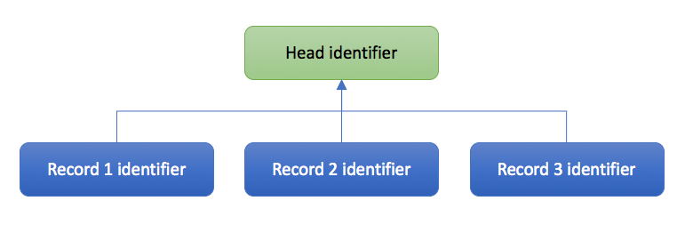

# Record versioning
In most cases it is not necessary to change, remove or add new files to a record. In fact, this is not possible without creating a new version of that record. In this guide, the files of an existing record are updated, thereby creating a new draft record. A JSON patch is prepared that will publish this new draft record. The published record will have different EPIC PIDs and DOIs than the original record. In the metadata there will be a reference to the old version.

As updates to metadata are exactly the same as for record or draft records, this is not discussed in this submodule. Please refer to the [Update record metadata](06_Update_record_metadata.md) and [Update all community metadata](07_Update_all_community_metadata.md) guides for information on how to do this.

This guide covers:
- The concept of record head identifiers
- Creating a new draft record from an existing published record
- Altering the files attached to the record
- Submitting a JSON patch to publish the new version
- Investigating the links to other versions

## Record head identifiers
Every record, whether it has been versioned or not, has a head identifier which is the same for all versions of that record. The head identifier has the same length as a record identifier. You can find this identifier in the metadata of each record in the `versions` field of the `links` field group.

In the images below this concept is explained. The figure on the left shows the state after creating a new original record. The figure right shows the state after creating two new records based on this original records (new versions). All records point to the same head identifier. The head identifier is not a record on itself but when requested redirects automatically to the latest version of these records.

<div align="center">


</div>

## Creating a new draft record from an existing published record
If you intend to change the files of an existing published record, a new version needs to be created. In this section, the file of a record will be deleted and replaced by a new version. The file is published in a new record.

#### Requesting a new draft
First, B2SHARE needs to be notified that a new draft record of an existing published record can be created. This can be done by issueing the following POST request through the API using the `version_of` parameter with the original record's identifier, your access token and a header specifying the media type:

```python
>>> header = {'Content-type': 'application/json'}
>>> r = requests.post('https://trng-b2share.eudat.eu/api/records/', params={'access_token': token, 'version_of': 'a766efd2e5d543968fff9dd7bf3783c5'}, headers=header)
>>> print r
<Response 201>
```

The response code indicates a new draft has been created. The returned information shows the metadata of the new draft:

```python
>>> print simplejson.dumps(r.json(), indent=4)
{
    "updated": "2018-01-12T14:01:09.181620+00:00",
    "metadata": {
        "community_specific": {},
        "publication_state": "draft",
        "open_access": true,
        "disciplines": [
            "1.4 \u2192 Humanities \u2192 Arts"
        ],
        "owners": [
            10
        ],
        "community": "e9b9792e-79fb-4b07-b6b4-b9c2bd06d095",
        "titles": [
            {
                "title": "My EUDAT Summer School upload"
            }
        ],
        "descriptions": [
            {
                "description": "Some description",
                "description_type": "Abstract"
            }
        ],
        "$schema": "https://trng-b2share.eudat.eu/api/communities/e9b9792e-79fb-4b07-b6b4-b9c2bd06d095/schemas/0#/draft_json_schema"
    },
    "id": "2ff3f5815db3494a840e6b3f1e6a6542",
    "links": {
        "files": "https://trng-b2share.eudat.eu/api/files/c01247ac-b129-4764-8b91-ee9646f2794d",
        "self": "https://trng-b2share.eudat.eu/api/records/2ff3f5815db3494a840e6b3f1e6a6542/draft",
        "publication": "https://trng-b2share.eudat.eu/api/records/2ff3f5815db3494a840e6b3f1e6a6542",
        "versions": "https://trng-b2share.eudat.eu/api/records/7be05b53b34145b59c9ab1bca5b7aee2/versions"
    },
    "created": "2018-01-12T14:01:09.181611+00:00"
}
```

The metadata and files are exactly the same, except for the file bucket identifier under the `files` field of th `links` field group. Also the values for `created`, `updated` and `publication_state` have changed. B2SHARE has copied the original files in this file bucket, so they can be altered by the owner of the record.

If a draft already exists based on the original record, this is indicated in the response text:

```python
{
    "goto_draft": "2ff3f5815db3494a840e6b3f1e6a6542",
    "status": 400,
    "message": "Versioning error. A draft already exists in the version chain designated by the specified `version_of` parameter."
}
```

As the message states, a new draft was already created from the original record. The `goto_draft` field then indicates the record identifier for this draft record.

#### Deleting a draft record version
You can delete a draft record version by using the DELETE method together with the record's URL. See the [Special requests](10_Special_requests.md#delete-a-draft-record) guide for more information.

## Altering the files attached to the record
Once the new version of the original record has been created, existing attached files can be updated by deleting one or more of the actual files and replacing it by uploading new files. The new files can be completely different from the original ones and therefore can have different file names, mimetypes and sizes.

Using the result from the previous request, first the current state of the files is retrieved with the file bucket id `c01247ac-b129-4764-8b91-ee9646f2794d`:

```python
>>> files = requests.get('https://trng-b2share.eudat.eu/api/files/c01247ac-b129-4764-8b91-ee9646f2794d', params=payload
... )
>>> print files.text
{
  "created": "2018-01-12T14:01:09.249898+00:00",
  "max_file_size": 10737418240,
  "locked": false,
  "links": {
    "versions": "https://trng-b2share.eudat.eu/api/files/c01247ac-b129-4764-8b91-ee9646f2794d?versions",
    "uploads": "https://trng-b2share.eudat.eu/api/files/c01247ac-b129-4764-8b91-ee9646f2794d?uploads",
    "self": "https://trng-b2share.eudat.eu/api/files/c01247ac-b129-4764-8b91-ee9646f2794d"
  },
  "contents": [
    {
      "delete_marker": false,
      "created": "2018-01-12T14:01:09.270276+00:00",
      "version_id": "276ddd27-a93d-4f3f-81f8-ae0fb6b20ed8",
      "key": "EUDAT-logo2011.jpg",
      "updated": "2018-01-12T14:01:09.278124+00:00",
      "size": 34282,
      "is_head": true,
      "links": {
        "version": "https://trng-b2share.eudat.eu/api/files/c01247ac-b129-4764-8b91-ee9646f2794d/EUDAT-logo2011.jpg?versionId=276ddd27-a93d-4f3f-81f8-ae0fb6b20ed8",
        "uploads": "https://trng-b2share.eudat.eu/api/files/c01247ac-b129-4764-8b91-ee9646f2794d/EUDAT-logo2011.jpg?uploads",
        "self": "https://trng-b2share.eudat.eu/api/files/c01247ac-b129-4764-8b91-ee9646f2794d/EUDAT-logo2011.jpg"
      },
      "checksum": "md5:1f7870a450d602d5baf30f558d6a1659",
      "mimetype": "image/jpeg"
    }
  ],
  "id": "c01247ac-b129-4764-8b91-ee9646f2794d",
  "quota_size": 21474836480,
  "updated": "2018-01-12T14:01:09.281005+00:00",
  "size": 34282
}
```

#### Deleting an existing file
To remove a file from the draft record, use the DELETE method together with the file bucket identifier and file name:

```python
>>> d = requests.delete('https://trng-b2share.eudat.eu/api/files/c01247ac-b129-4764-8b91-ee9646f2794d/EUDAT-logo2011.jpg', params=payload)
>>> print d.text
<Response [204]>
```

There is no response text. The files metadata now looks as follows:

```python
>>> files = requests.get('https://trng-b2share.eudat.eu/api/files/c01247ac-b129-4764-8b91-ee9646f2794d', params=payload)
>>> print files.text
{
  "created": "2018-01-12T14:01:09.249898+00:00",
  "max_file_size": 10737418240,
  "locked": false,
  "links": {
    "versions": "https://trng-b2share.eudat.eu/api/files/c01247ac-b129-4764-8b91-ee9646f2794d?versions",
    "uploads": "https://trng-b2share.eudat.eu/api/files/c01247ac-b129-4764-8b91-ee9646f2794d?uploads",
    "self": "https://trng-b2share.eudat.eu/api/files/c01247ac-b129-4764-8b91-ee9646f2794d"
  },
  "contents": [],
  "id": "c01247ac-b129-4764-8b91-ee9646f2794d",
  "quota_size": 21474836480,
  "updated": "2018-01-12T16:23:18.681461+00:00",
  "size": 34282
}
```

There is no file anymore, although the original data size is still indicated.

#### Add new files
The original file is going to be replaced with a new version of that file. For a more elaborate description on how to upload files, please refer to the [Create new record](05_Create_new_record.md#add-files-to-your-new-draft-record) guide on uploading files.

Two headers are required that indicate the content type and the response data type:

```python
>>> header = {"Accept": "application/json", "Content-Type": "application/octet-stream"}
```

Open the file to a handle and check whether this succeeded:

```python
>>> upload_file = open('ess2017/EUDAT-logo2011.jpg', 'rb')
>>> print upload_file
<open file 'ess2017/EUDAT-logo2011.jpg', mode 'rb' at 0x104751660>
```

The actual request is made using a PUT method and the file bucket identifier and file name in the URL:

```python
>>> r = requests.put('https://trng-b2share.eudat.eu/api/files/c01247ac-b129-4764-8b91-ee9646f2794d/EUDAT-logo2011.jpg', data=upload_file, params=payload, headers=header)
>>> print r
<Response [200]>
```

The status code of the request is 200 so the upload worked! Again check the files metadata of the versioned record to verify a successful upload:

```python
>>> files = requests.get('https://trng-b2share.eudat.eu/api/files/c01247ac-b129-4764-8b91-ee9646f2794d', params=payload)
>>> print files.text
{
  "created": "2018-01-12T14:01:09.249898+00:00",
  "max_file_size": 10737418240,
  "locked": false,
  "links": {
    "versions": "https://trng-b2share.eudat.eu/api/files/c01247ac-b129-4764-8b91-ee9646f2794d?versions",
    "uploads": "https://trng-b2share.eudat.eu/api/files/c01247ac-b129-4764-8b91-ee9646f2794d?uploads",
    "self": "https://trng-b2share.eudat.eu/api/files/c01247ac-b129-4764-8b91-ee9646f2794d"
  },
  "contents": [
    {
      "delete_marker": false,
      "created": "2018-01-12T16:30:09.029061+00:00",
      "version_id": "1d406342-bc3c-4750-a16f-34c1cdccb4c2",
      "key": "EUDAT-logo2011.jpg",
      "updated": "2018-01-12T16:30:09.032767+00:00",
      "size": 34128,
      "is_head": true,
      "links": {
        "version": "https://trng-b2share.eudat.eu/api/files/c01247ac-b129-4764-8b91-ee9646f2794d/EUDAT-logo2011.jpg?versionId=1d406342-bc3c-4750-a16f-34c1cdccb4c2",
        "uploads": "https://trng-b2share.eudat.eu/api/files/c01247ac-b129-4764-8b91-ee9646f2794d/EUDAT-logo2011.jpg?uploads",
        "self": "https://trng-b2share.eudat.eu/api/files/c01247ac-b129-4764-8b91-ee9646f2794d/EUDAT-logo2011.jpg"
      },
      "checksum": "md5:96c403b2882ac4d9dec0e9f6a9f19a48",
      "mimetype": "image/jpeg"
    }
  ],
  "id": "c01247ac-b129-4764-8b91-ee9646f2794d",
  "quota_size": 21474836480,
  "updated": "2018-01-12T16:30:09.097762+00:00",
  "size": 68410
}
```

The file has been uploaded successfully and is present in the metadata.

## Submitting a JSON patch to publish the new version
Now that the new versioned draft record is complete, the draft state can be changed to `published` again using a JSON patch PATCH request. To see in detail on how to do this, refer to the [Create new record](05_Create_new_record.md#publishing-your-draft-record) guide. In short, create a patch and send it through a PATCH request with the versioned draft record identifier in the URL:

```python
>>> header = {'Content-Type': 'application/json-patch+json'}
>>> patch = '[{"op": "add", "path":"/publication_state", "value": "submitted"}]'
>>> r = requests.patch('https://trng-b2share.eudat.eu/api/records/2ff3f5815db3494a840e6b3f1e6a6542/draft', data=patch, params=payload, headers=header)
>>> print r.text
{
  "created": "2018-01-12T14:01:09.181611+00:00",
  "id": "2ff3f5815db3494a840e6b3f1e6a6542",
  "links": {
    "files": "https://trng-b2share.eudat.eu/api/files/c01247ac-b129-4764-8b91-ee9646f2794d",
    "publication": "https://trng-b2share.eudat.eu/api/records/2ff3f5815db3494a840e6b3f1e6a6542",
    "self": "https://trng-b2share.eudat.eu/api/records/2ff3f5815db3494a840e6b3f1e6a6542/draft",
    "versions": "https://trng-b2share.eudat.eu/api/records/7be05b53b34145b59c9ab1bca5b7aee2/versions"
  },
  "metadata": {
    "$schema": "https://trng-b2share.eudat.eu/api/communities/e9b9792e-79fb-4b07-b6b4-b9c2bd06d095/schemas/0#/draft_json_schema",
    "DOI": "http://doi.org/XXXX/b2share.2ff3f5815db3494a840e6b3f1e6a6542",
    "community": "e9b9792e-79fb-4b07-b6b4-b9c2bd06d095",
    "community_specific": {},
    "descriptions": [
      {
        "description": "Some description",
        "description_type": "Abstract"
      }
    ],
    "disciplines": [
      "1.4 \u2192 Humanities \u2192 Arts"
    ],
    "ePIC_PID": "http://hdl.handle.net/0000/2ff3f5815db3494a840e6b3f1e6a6542",
    "open_access": true,
    "owners": [
      10
    ],
    "publication_state": "published",
    "titles": [
      {
        "title": "My EUDAT Summer School upload"
      }
    ]
  },
  "updated": "2018-01-12T16:43:33.632923+00:00"
}
```

The version draft record is now published. If you now go the the [original record's landing page](https://trng-b2share.eudat.eu/records/a766efd2e5d543968fff9dd7bf3783c5) the dropdown element in the top-right corner indicates that there is a newer version available. The [versioned record landing page](https://trng-b2share.eudat.eu/records/2ff3f5815db3494a840e6b3f1e6a6542) indicates that the current record is the latest version.

## Get all record versions
You can get an overview of all versions of a specific version by using the `versions` endpoint after the record head identifier. This identifier can be extracted from the record's metadata under the `versions` field in the `links` field group.

Using the result of the previous request:

```python
>>> v = requests.get(r.json()['links']['versions'])
>>> print v.text
{
  "versions": [
    {
      "created": "Wed, 05 Jul 2017 09:40:14 GMT",
      "id": "a766efd2e5d543968fff9dd7bf3783c5",
      "updated": "Tue, 19 Dec 2017 12:15:06 GMT",
      "url": "https://trng-b2share.eudat.eu/api/records/a766efd2e5d543968fff9dd7bf3783c5",
      "version": 1
    },
    {
      "created": "Fri, 12 Jan 2018 16:43:33 GMT",
      "id": "2ff3f5815db3494a840e6b3f1e6a6542",
      "updated": "Fri, 12 Jan 2018 16:43:33 GMT",
      "url": "https://trng-b2share.eudat.eu/api/records/2ff3f5815db3494a840e6b3f1e6a6542",
      "version": 2
    }
  ]
}
```

The two versions are clearly indicated in the metadata.
