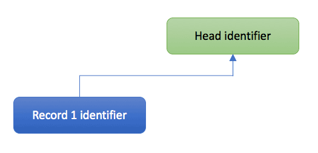

# Record versioning
In most cases it is not necessary to change, remove or add new files to a record. In fact, this is not possible without creating a new version of that record. In this guide, the files of an existing record are updated, thereby creating a new draft record. A JSON patch is prepared that will publish this new draft record. The published record will have different EPIC PIDs and DOIs than the original record. In the metadata there will be a reference to the old version.

As updates to metadata are exactly the same as for record or draft records, this is not discussed in this submodule. Please refer to the [Update record metadata](06_Update_record_metadata.md) and [Update all community metadata](07_Update_all_community_metadata.md) guides for information on how to do this.

This guide covers:
- The concept of record head identifiers
- Creating a new draft record from an existing published record
- Altering the files attached to the record
- Submitting a JSON patch to publish the new version
- Investigating the links to other versions

## Record head identifiers
Every record, whether it has been versioned or not, has a head identifier which is the same for all versions of that record. The head identifier has the same length as a record identifier. You can find this identifier in the metadata of each record in the `versions` field of the `links` field group.

In the images below this concept is explained. The figure on the left shows the state after creating a new original record. The figure right shows the state after creating two new records based on this original records (new versions). All records point to the same head identifier. The head identifier is not a record on itself but when requested redirects automatically to the latest version of these records.

<div align="center">


</div>

## Creating a new draft record from an existing published record
If you intend to change the files of an existing published record, a new version needs to be created. In this section, the file of a record will be deleted and replaced by a new version. The file is published in a new record.

#### Requesting a new draft
First, B2SHARE needs to be notified that a new draft record of an existing published record can be created. This can be done by issueing the following POST request through the API using the `version_of` parameter:

```python
>>> r = requests.post('https://trng-b2share.eudat.eu/api/records/', params={'version_of': 'a766efd2e5d543968fff9dd7bf3783c5'})
>>> print r
<Response 201>
```

The response code indicates a new draft has been created. The returned information shows the metadata of the new draft:

```python
>>> print json.dumps(r.text, indent=4)
{
    "created": "2018-01-11T11:54:29.202257+00:00",
    "id": "1b283e8a4aff4695b82c147cdcecfdc7",
    "links": {
        "files": "https://trng-b2share.eudat.eu/api/files/0bfdb84b-3a66-4122-822f-df258b2a9aab",
        "publication": "https://trng-b2share.eudat.eu/api/records/1b283e8a4aff4695b82c147cdcecfdc7",
        "self": "https://trng-b2share.eudat.eu/api/records/1b283e8a4aff4695b82c147cdcecfdc7/draft",
        "versions": "https://trng-b2share.eudat.eu/api/records/7be05b53b34145b59c9ab1bca5b7aee2/versions"
    },
    "metadata": {
        "$schema": "https://trng-b2share.eudat.eu/api/communities/e9b9792e-79fb-4b07-b6b4-b9c2bd06d095/schemas/0#/draft_json_schema",
        "community": "e9b9792e-79fb-4b07-b6b4-b9c2bd06d095",
        "community_specific": {},
        "descriptions": [{
            "description": "Some description",
            "description_type": "Abstract"
        }],
        "disciplines": ["1.4 \u2192 Humanities \u2192 Arts"],
        "open_access": true,
        "owners": [10],
        "publication_state": "draft",
        "titles": [{
            "title":"My EUDAT Summer School upload"
        }]
    },
    "updated": "2018-01-11T11:54:29.202268+00:00"
}
```

The metadata and files are exactly the same, except for the file buck identifier. Also the values for `created`, `updated` and `publication_state` have changed.

If a draft already exist based on the original record, this is indicated in the response text:

```python
{
    "goto_draft": "1b283e8a4aff4695b82c147cdcecfdc7",
    "status": 400,
    "message": "Versioning error. A draft already exists in the version chain designated by the specified `version_of` parameter."
}
```

As the message states, a new draft was already created from the original record. The `goto_draft` field then indicates the record identifier for this draft record.

#### Deleting a record version


## Altering the files attached to the record

#### Delete an existing file

#### Add new files

#### Check current file bucket status

## Submitting a JSON patch to publish the new version

## Get all record versions
You can get an overview of all versions of a specific version by using the `versions` endpoint after the record identifier.