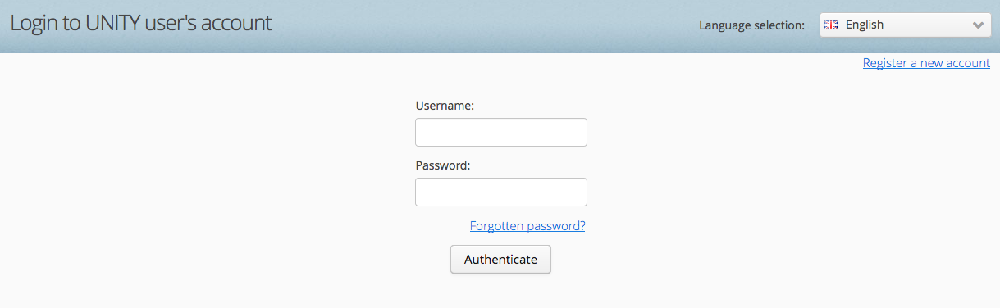
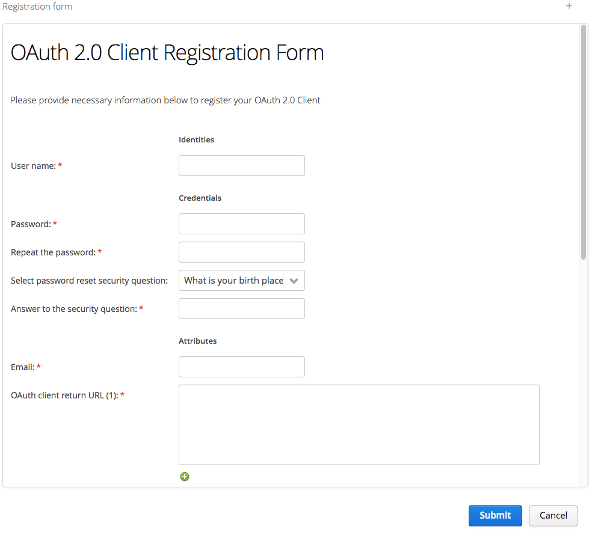
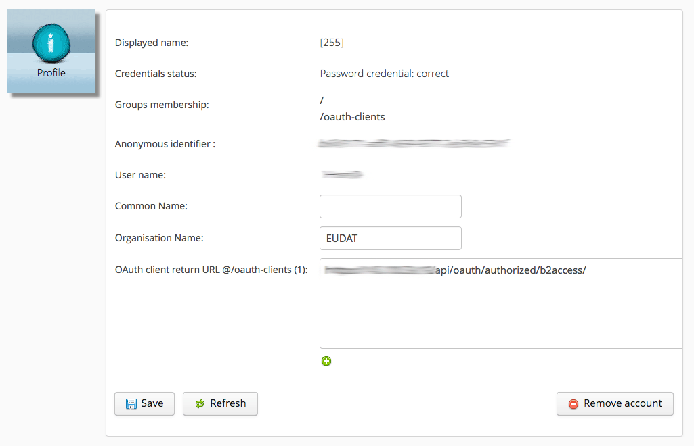

# Installation
This module will take you through the installation of the required package and software in order to deploy your own B2SHARE instance.

The information on this page is based on the [B2SHARE installation guide](https://github.com/EUDAT-B2SHARE/b2share/blob/evolution/INSTALL.rst) provided by the developers. It covers:

- Installing prerequisites
- Configuring B2ACCESS
- Installing tools and Docker
- Configuring environment variables

## Things to note
Installing B2SHARE comes with responsibility and as with every web service, security is very important. Therefore never install B2SHARE as user root, but instead create a separate user that is allowed to run the B2SHARE service. Log in as this user before you start installing the software.

## Supported platforms
Currently the following platforms are supported:

- Ubuntu 14.04+
- CentOS 6.7+

In the following guides it is assumed that B2SHARE is installed on Ubuntu. Any Ubuntu-specific commands should be translatable to other platforms without any complications.

## Prerequisites
The following packages need to be installed:

- git
- curl
- docker
- docker-engine
- docker-compose

Make sure your platform is fully up-to-date:

```sh
$ sudo apt-get update
```

## Configuring B2ACCESS
Before you can install B2SHARE, B2ACCESS needs to be configured.

### Different B2ACCESS instances
Currently there are two instances of B2ACCESS running:

- An [acceptance (testing) instance](https://unity.eudat-aai.fz-juelich.de:8443/home/home) run by [Jülich Forschungszentrum](http://www.fz-juelich.de)

This instance can be used to test your instance. Any user registration request will be automatically granted and therefore can be immediately used.

- The [production instance](https://b2access.eudat.eu/home/home) run by EUDAT

The production instance of B2ACCESS can only be used for production instance of B2SHARE. You registration requests will only be granted if sufficient information is provided that you need an actual production registration.

For the remaining part of this guides and all other guides, it is assumed that the B2ACCESS acceptance instance is used. For more information on B2ACCESS and its configuration, please refer to the EUDAT user documentation on [B2ACCESS service integration](https://eudat.eu/services/userdoc/b2access-service-integration).

### Registering your B2ACCESS OAuth 2.0 client
To let B2SHARE automatically communicate with B2ACCESS a OAuth 2.0 Client registration is required.

- Go to the [B2ACCESS acceptance instance](https://unity.eudat-aai.fz-juelich.de:8443/home/home) and click on 'Register a new account' (top-right):



- Click 'OAuth 2.0 Client Registration Form' and fill in a user name, passwords, security question answers and your email address:
 - Carefully remember your username and password, as this will be needed later on (see [below](#set-environment-variables))



- Take special care for the OAuth client return URL. This needs to be your fully qualified domain name (FQDN) plus the API endpoint for B2ACCESS in the B2SHARE service, e.g.:

```
https://my-domain.com/api/oauth/authorized/b2access/
```

This value can always be changed later by logging in to B2ACCESS again with the newly created credentials.

- Upon successfull registration, you will see the following overview:



### Registering a new user for B2SHARE
For testing purposes, a different user can be registered which can be used to log in to your own B2SHARE instance and upload new records. Again go to the [B2ACCESS acceptance instance](https://unity.eudat-aai.fz-juelich.de:8443/home/home) and click on 'Register a new account'. Now select 'EUDAT staff' and fill out the form.

Alternatively, you can use your social ID or institutional credentials by selecting the corresponding authentication option when logging in to B2SHARE.

## Install tools
The basic tools are installed by running the following command:

```sh
$ sudo apt-get install git curl
```

### Install Docker
To install Docker, Docker Engine and Docker Compose, please follow the following guide for [Ubuntu](https://docs.docker.com/engine/installation/linux/ubuntu/) or [CentOS](https://docs.docker.com/engine/installation/linux/centos/). Guides for other platforms are provided on the general [installation overview](https://docs.docker.com/engine/installation/) page.

Please read the guides carefully as many steps are involved, including adding Docker's own package repository. After setting this up, run `apt-get update` so that the Docker packages can be found.

To check whether you have successfully installed Docker run:

```sh
$ sudo docker run hello-world
```

For Docker compose run:

```sh
$ docker-compose --version
```

#### Running Docker as a non-root user
To successfully run Docker as a non-root user, the user you are using must be added to the `docker` Linux group.

First, create the group `docker`:

```sh
$ sudo groupadd docker
```

Add your user to the group:

```sh
$ sudo usermod -aG docker $user
```

#### Configuring Docker
Further configuration can be added to the Docker setup, for example to start the Docker daemon on boot. Please refer to the general [Linux post-installation guide](https://docs.docker.com/engine/installation/linux/linux-postinstall) for more information. It also contains [troubleshooting information](https://docs.docker.com/engine/installation/linux/linux-postinstall/#use-a-different-storage-engine) in case you need it.

## Install B2SHARE
Now the B2SHARE software package can be installed. It is located in the GitHub repository of EUDAT-B2SHARE and can be downloaded directly:

```sh
$ git clone https://github.com/EUDAT-B2SHARE/b2share.git
```

### Set environment variables
B2SHARE requires several environment variables that are used by the Docker containers to run. These need to be known before the containers are started.

You can run add each variable using the `export` command individually, but it might be easier to create a file `setenv.sh` somewhere on your system or to add the environment variables directly to your `.bash_profile` file. It is advisable to enclose all values between single quotes to avoid problems in interpretation of these values.

- Add the B2ACCESS OAuth client username and password:

```sh
$ export B2ACCESS_CONSUMER_KEY='username'
$ export B2ACCESS_SECRET_KEY='password'
```

- To encrypt user sessions a B2SHARE secret key must be set as an environment variable. It is recommended to use a randomly generated string for this purpose:

```sh
$ export B2SHARE_SECRET_KEY='some random key'
```

- Set the host domain for the JSON schemas callback:

```sh
$ export B2SHARE_JSONSCHEMAS_HOST='domain'
```

- Set up the PostgreSQL database database name and credentials. Note these are not the credentials you created for B2ACCESS access.

```sh
$ export B2SHARE_POSTGRESQL_DBNAME='dbname'
$ export B2SHARE_POSTGRESQL_PASSWORD='password'
$ export B2SHARE_POSTGRESQL_USER='user'
```

- Set a mount location for B2SHARE-related containers and data. This location does need to exist as it will be created by B2SHARE:

```sh
$ export B2SHARE_DATADIR='/home/ubuntu/b2share-data'
```

- Indicate the B2ACCESS environment to be used. To use the acceptance instance of B2ACCESS, set this value to 1. For production installations, use the production instance of B2ACCESS and set this value to 0:

```sh
$ export USE_STAGING_B2ACCESS=1              # to run with staging (testing) b2access (unity install)
```

- Make sure the database and indexes are properly initialized (value 1):

```sh
$ export INIT_DB_AND_INDEX=1                 # when run the first time, initialize the database and indices
```

- If you want to load sample communities and records, set the following variable to 1:

```sh
$ export LOAD_DEMO_COMMUNITIES_AND_RECORDS=0
```

Please note that this will load several communities and records. If you need to have clean install, leave it to 0.

### The b2share.cfg file
Many settings are made directly in the Python `b2share.cfg` file, of which an example can be found [here](https://github.com/EUDAT-B2SHARE/v2-prod-instance/blob/master/b2share.cfg). Please refer to the [B2SHARE Python Configuration](06_B2SHARE_Python_configuration.md) guide to learn how this file can be used to configure your own B2SHARE instance.

## Building and running B2SHARE
Now that everything has been set up properly, the B2SHARE instance can be build:

```sh
$ docker-compose build
```

Although there might be several reported problems, if the command is completed successfully, B2SHARE is ready to be launched.


### Running B2SHARE
To run B2SHARE and start the web service run the following command:

```sh
$ docker-compose up -d
```

Now your own B2SHARE instance is available in your own domain! It might take a while before the service is fully running, so be patient and check back after a few minutes in your browser.

### Log into B2SHARE
To test the successfull configuration of B2ACCESS within B2SHARE, try to log in with a user (not the OAuth client user). If there are no errors, your B2ACCESS configuration is correct.

## Troubleshooting
As with any installation of software or services, problems might arise. This section contains several issues that can be solved easily.


### General inspection
If B2SHARE is not building properly or the web service cannot be accessed, first inspect the logs of the Docker containers:

```sh
$ docker-compose logs -f b2share
```

Try if you can find any reported problems which might impact the performance of the system.

### B2ACCESS connection problems
If you experience any problems during logging in, there might be problem with the B2ACCESS configuration. A common error is:

```
 ERROR

OAuth Authorization Server got an invalid request.

If you are a user then you can be sure that the web application you was using previously is either misconfigured or buggy.

If you are an administrator or developer the details of the error follows:

The '<username>' requested to use a not registered response redirection URI: <OAuth URL>
```

This means that your B2ACCESS OAuth URL is not properly configured, probably due to an erroneous domain name or incorrect endpoint. Please visit the corresponding B2ACCESS instance (see [above](#different-b2access-instances), log in with your OAuth Client user and enter the correct URL in the `OAuth client return URL` field.
