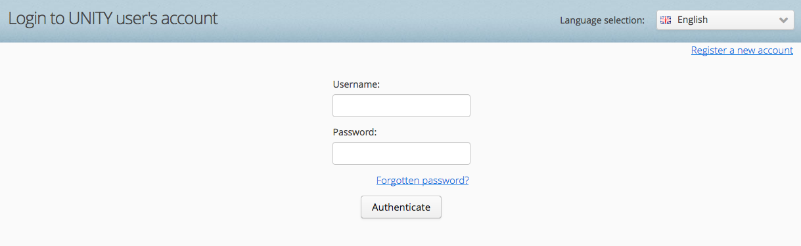

# Services configuration
Several services are connected to B2SHARE in order to make it function smoothly. In this guide the configuration of each of these services is described.

In this guide the following services are discussed:
- [B2ACCESS](#configuring+b2access): use institional or social credentials for access using EUDAT's [federated authentication and authorisation service](https://b2access.eudat.eu)
- [B2HANDLE](#configuring+b2handle): registration and resolving of EPIC handles using EUDAT's [persistent identifier service](https://www.eudat.eu/services/userdoc/b2handle)
- [B2DROP](#configuring+b2drop): direct publication from EUDAT's [data sharing and exchange service](https://b2drop.eudat.eu)
- [DOI](#configuring+digital+object+identifier+doi+service): registration and resolving of [DOI persistent identifiers](http://www.doi.org)
- [B2NOTE](#configuring+b2note): adding metadata to files using EUDAT's [semantic annotation service](https://b2note.bsc.es) (in pilot phase)

In addition, the following services are described:
- [OAI-PMH](#configuring+oai-pmh): metadata harvesting by external metadata catalogus services like [B2FIND](http://b2find.eudat.eu)

## Configuring B2ACCESS
In this section the configuration of B2ACCESS is described. B2ACCESS is always enabled and cannot be turned off.

In the `b2share/config.py` file the following block configures B2ACCESS services.

```python
B2ACCESS_BASE_URL = 'https://b2access.eudat.eu/'
if os.environ.get("USE_STAGING_B2ACCESS"):
	B2ACCESS_BASE_URL = 'https://unity.eudat-aai.fz-juelich.de/'
```

Using the `USE_STAGE_B2ACCESS` variable, you can quickly switch between production and other instances of B2ACCESS.

### Different B2ACCESS instances
Currently there are three different instances of B2ACCESS running:

- A [development (testing) instance](https://unity.eudat-aai.fz-juelich.de:8443/home/home) run by [Jülich Forschungszentrum](http://www.fz-juelich.de)

This instance can be used to test your instance while it is under development. Any user registration request will be automatically granted and therefore can be immediately used. Please note that this service may temporarily go offline unannounced.

- An [acceptance (testing) instance](https://b2access-integration.fz-juelich.de/home/home), also run by [Jülich Forschungszentrum](http://www.fz-juelich.de)

This instance can be used to test your instance after development has finished, but your service is not in production. It allows test scenarios with a large number of users. Any user registration needs approval by the maintainers of B2ACCESS. Please note that this instance cannot be used for development or early testing purposes of your instance of B2SHARE.

- The [production instance](https://b2access.eudat.eu/home/home) run by EUDAT

The production instance of B2ACCESS can only be used for production instance of B2SHARE. You registration requests will only be granted if sufficient information is provided that you need an actual production registration.

For the remaining part of this guides and all other guides, it is assumed that the B2ACCESS development instance is used. For more information on B2ACCESS and its configuration, please refer to the EUDAT user documentation on [B2ACCESS service integration](https://eudat.eu/services/userdoc/b2access-service-integration).

### Registering your B2ACCESS OAuth 2.0 client
To let B2SHARE automatically communicate with B2ACCESS a OAuth 2.0 Client registration is required.

- Go to the [B2ACCESS acceptance instance](https://unity.eudat-aai.fz-juelich.de:8443/home/home) and click on 'Register a new account' (top-right):



- Click 'OAuth 2.0 Client Registration Form' and fill in a user name, passwords, security question answers and your email address:
 - Carefully remember your username and password, as this will be needed later on (see [below](#set-environment-variables))


- Take special care for the OAuth client return URL. This needs to be your fully qualified domain name (FQDN) plus the API endpoint for B2ACCESS in the B2SHARE service, e.g.:

```
https://my-domain.com/api/oauth/authorized/b2access/
```

This value can always be changed later by logging in to B2ACCESS again with the newly created credentials.

- Upon successfull registration, you will see the following overview:


### Registering a new user for B2SHARE
Once you've successfully set up B2ACCESS, you can continue with the registration of a administrative user that will be able to configure B2ACCESS.

Refer to the [User management](09_User_management.md#Registering+a+new+user+for+B2SHARE) guide on how to register a new user in B2ACCESS.

## Configuring B2HANDLE
In this section the configuration of B2HANDLE is described.

Look for the ePIC PID configuration block in the `b2share/config.py` file:

```python
# ePIC PID config
# ===============

CFG_HANDLE_SYSTEM_BASEURL = 'http://hdl.handle.net'
CFG_FAIL_ON_MISSING_PID = False
CFG_FAIL_ON_MISSING_FILE_PID = False

# CFG_EPIC_USERNAME = 0000
# CFG_EPIC_PASSWORD = ''
# CFG_EPIC_BASEURL = 'https://epic4.storage.surfsara.nl/v2_A/handles/'
# CFG_EPIC_PREFIX = 0000

# for manual testing purposes, FAKE_EPIC_PID can be set to True
# in which case a fake epic pid will be generated for records
# FAKE_EPIC_PID = False
```

In general, these values can be left intact, unless you want to use your own prefix. As a prefix is maintained at a specific ePIC instance, you have to configure and uncomment the variables `CFG_EPIC_USERNAME`, `CFG_EPIC_PASSWORD`, `CFG_EPIC_BASEURL` and `CFG_EPIC_PREFIX`.

To use a different resolver for any ePIC PID, set the value for `CFG_HANDLE_SYSTEM_BASEURL`. To display error messages in case a PID is missing for a record or any of its files, set the values for `CFG_FAIL_ON_MISSING_PID` and `CFG_FAIL_ON_MISSING_FILE_PID` to 'True'.

To create fake PIDs during testing, uncomment the `FAKE_EPIC_PID` variable and set its value to 'True'. Make sure to remove this option as soon as you are running your instance in production mode!

## Configuring B2DROP
In this section the configuration of B2DROP is described. By default, B2DROP is enabled in your instance.

In case you want to change the B2DROP functionality to use another instance of B2DROP or your own Webdav enabled file service, edit the `b2share/config.py` and look for the following structure:

```python
B2DROP_SERVER = {
    'host': 'b2drop.eudat.eu',
    'protocol': 'https',
    'path': '/remote.php/webdav/',
}
```

Set the host to the domain of your B2DROP or file service, the protocol to either 'http' or 'https' and the path to the endpoint the Webdav protocol can communicate with.

## Configuring Digital Object Identifier (DOI) service
In this section the enabling and configuration of the Digital Object Identifier (DOI) service is described. With this service new DOIs can be minted, administered and resolved. B2SHARE only supports minting new DOIs through this service and will store the newly created DOIs in the metadata of each record.

Look for the DOI configuration block in the `b2share/config.py` file:

```python
# DOI config
# ==========

AUTOMATICALLY_ASSIGN_DOI = False
DOI_IDENTIFIER_FORMAT = 'b2share.{recid}'
CFG_FAIL_ON_MISSING_DOI = False

PIDSTORE_DATACITE_TESTMODE = False
PIDSTORE_DATACITE_DOI_PREFIX = "XXXX"
PIDSTORE_DATACITE_USERNAME = "XXXX"
PIDSTORE_DATACITE_PASSWORD = "XXXX"
```

To enable DOI minting during creation of new records, set the value for `AUTOMATICALLY_ASSIGN_DOI` to 'True'. The format of the identifier can be set with the `DOI_IDENTIFIER_FORMAT`. The `{recid}` variable will be replaced with the identifier of the record. Always leave `CFG_FAIL_ON_MISSING_DOI` to 'False', to avoid display of exceptions in case the DOI couldn't be created. All errors will be logged to the log file of B2SHARE.

The `PIDSTORE_DATACITE_TESTMODE` variable is currently not used, so can be left as it is. Set the values `PIDSTORE_DATACITE_DOI_PREFIX`, `PIDSTORE_DATACITE_USERNAME` and `PIDSTORE_DATACITE_PASSWORD` to your own values and make sure these values allow to mint new DOIs through the DOI minting service.


## Configuring B2NOTE
In this section the enabling and configuration of B2NOTE is described.

The B2NOTE service extension is only available when a URL is provided that links the B2NOTE service. Enabling the service for B2SHARE can be achieved by setting the value for `B2NOTE_URL` to `https://b2note.bsc.es/devel/interface_main.html` in the `b2share/config.py` configuration file:

```python
B2NOTE_URL = 'https://b2note.bsc.es/devel/interface_main.html'
```

If you have your own instance of B2NOTE running (currently not supported) you can change this URL accordingly.

## Configuring OAI-PMH
In this section the configuration of OAI-PMH for metadata harvesting is described.

```python
OAISERVER_ID_PREFIX = 'oai:b2share.eudat.eu:b2rec/'
```

Replace the value for `OAISERVER_ID_PREFIX` to use the domain of your B2SHARE instance.

